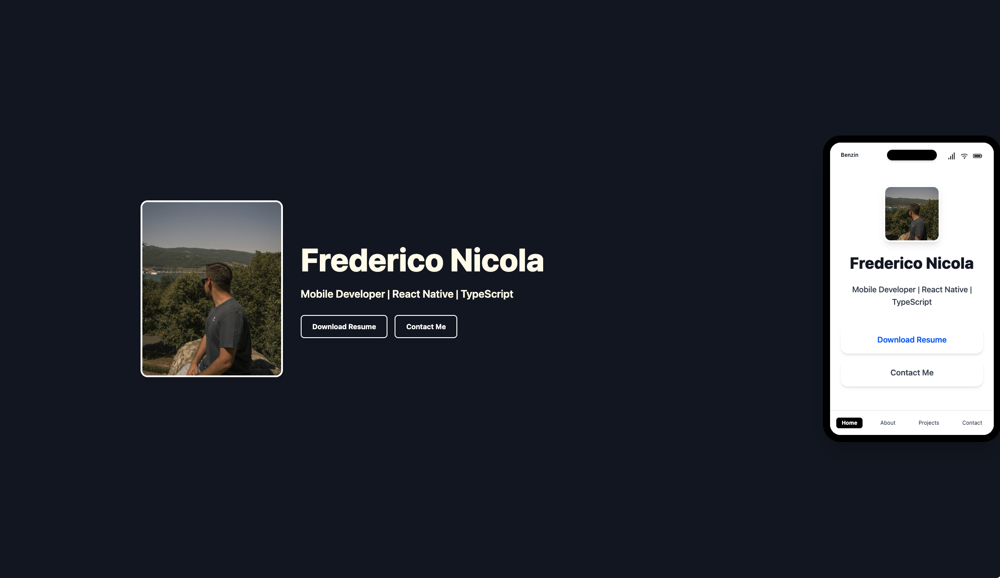

# 🚀 Frederico Nicola Portfolio

Welcome to my personal portfolio!  
This project showcases my work, skills, and journey as a Mobile Developer specializing in React Native, TypeScript, Kotlin, and MAUI.



---

## ✨ Features

- **Responsive Design:** Beautiful on both web and mobile.
- **About Me:** My journey, skills, and fun facts.
- **Projects & Experience:** Highlighted open-source and professional work.
- **Contact:** Easy ways to reach me (LinkedIn, Email, GitHub).
- **Dark/Light Mode:** Adapts to your system preference.
- **Modern Stack:** Built with React, Vite, TypeScript, and Tailwind CSS.

---

## 🛠️ Tech Stack

- [React](https://react.dev/)
- [Vite](https://vitejs.dev/)
- [TypeScript](https://www.typescriptlang.org/)
- [Tailwind CSS](https://tailwindcss.com/)
- [React Router](https://reactrouter.com/)

---

## 📦 Getting Started

1. **Clone the repo:**

   ```bash
   git clone https://github.com/fredericonicola/portfolio-app.git
   cd portfolio-app
   ```

2. **Install dependencies:**

   ```bash
   npm install
   # or
   yarn
   ```

3. **Run the development server:**

   ```bash
   npm run dev
   # or
   yarn dev
   ```

4. **Open in your browser:**
   ```
   http://localhost:5173
   ```

---

## 📁 Project Structure

```
src/
  components/      # Reusable UI components
  pages/           # Page components (web & mobile)
  data/            # Data arrays (projects, contacts, etc.)
  assets/          # Images and static assets
  App.tsx
  main.tsx
```

---

## 🌍 Live Demo

[fredericonicola.com](https://fredericonicola.com)

---

## 📫 Contact

- [LinkedIn](https://www.linkedin.com/in/fredericonicola/)
- [GitHub](https://github.com/fredericonicola)
- Email: frederico.nicola@email.com

---

## 🏞️ Fun Fact

I love cars and driving on beautiful roads with amazing views. If you see me out there, give a wave! 👋🚗

---

## ⭐️ Show your support

If you like this project, please consider starring the repo or connecting with me!

---
